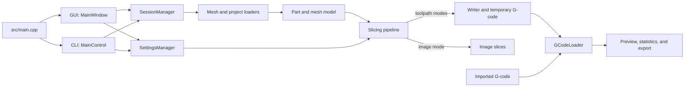

# ORNLSlicer Architecture

## Purpose

This document is the high-level map of the ORNLSlicer codebase. Use it to find
the subsystem that owns a behavior, then follow the linked architecture pages
for implementation detail. Public API details remain in Doxygen comments, and
task-focused user and contributor material remains in the
[`docs/` index](docs/README.md) and [`CONTRIBUTING.md`](CONTRIBUTING.md).

The descriptions here reflect the current code. Update them when ownership,
runtime flow, or an extension seam changes.

## System at a Glance

[`src/main.cpp`](src/main.cpp) selects one of two application shells. Runs with
command-line arguments use `QCoreApplication` and `MainControl`; runs without
arguments use `QApplication` and `MainWindow`. Both paths share the session,
settings, and slicing subsystems. Toolpath modes also share writer and G-code
parsing services.

## Repository Map

| Area | Responsibility |
| --- | --- |
| [`include/`](include/) and [`src/`](src/) | Project headers and matching implementations, grouped by subsystem |
| [`resources/settings/`](resources/settings/) | Canonical YAML metadata for user settings |
| [`resources/configs/`](resources/configs/) | Generated settings data and Qt resource manifests |
| [`resources/`](resources/) | Other embedded icons, shaders, styles, and textures |
| [`templates/`](templates/) | Installed printer and process templates |
| [`docs/`](docs/README.md) | User, contributor, and detailed architecture documentation |
| [`scripts/`](scripts/) | Settings generation, packaging, and maintenance utilities |
| [`cmake/`](cmake/) and [`CMakeLists.txt`](CMakeLists.txt) | Native build configuration and generated build metadata |
| [`nix/`](nix/) and [`flake.nix`](flake.nix) | Reproducible packages, dependencies, and development shells |

The directory pairing between `include/` and `src/` is the quickest way to find
an implementation after locating a public type. Cross-cutting constants, enums,
units, and Qt/JSON conversion helpers live under `utilities/` and `units/`.

## Major Boundaries

### Application and Session

`MainWindow` owns the GUI composition, while `MainControl` coordinates the
headless path. `SessionManager` is the shared owner of loaded `Part` objects,
raw model data needed for project persistence, recent-session state, and the
active slicer. Loader classes provide established Qt worker boundaries, with a
synchronous CLI mesh-loading path and a synchronous project-version preflight.
The current `SessionLoader` also reads and mutates manager-owned state from its
worker before signaling completion, an exception described in the detailed
runtime page.

See [Application Runtime](docs/architecture/application-runtime.md) for startup,
ownership, persistence, and worker boundaries.

### Settings

`SettingsManager` loads embedded setting metadata, holds the active global
settings, manages templates, and applies version migrations. Settings snapshots
start with defaults and selected templates, apply global adjustments, then add
mode-specific local scope. The planar pipeline applies part, layer-range, and
spatial settings-region overrides.

See [Settings System](docs/architecture/settings-system.md) for the source and
generation pipeline, runtime scopes, UI construction, and migration rules.

### Slicing and Pathing

`SessionManager::doSlice()` selects planar, cylindrical, or image slicing.
Cylindrical settings choose radial or helical path generation. Planar and
cylindrical slicers preprocess geometry into `Step` objects. Planar mode
computes region pathing on `StepThread` workers; cylindrical modes generate
their direct paths during preprocessing. Toolpath modes then postprocess paths
and modifiers and emit G-code through a selected writer. Image slicing
generates image files during preprocessing and skips ordinary G-code output.

See [Slicing Pipeline](docs/architecture/slicing-pipeline.md) for phase order,
the path data model, concrete slicer differences, and extension points.

### G-Code and Visualization

`WriterBase` implementations translate paths into machine-specific text.
`GCodeLoader` parses generated or imported files, calculates metadata, creates
visual segments, and sends independent outputs to the text view, OpenGL preview,
layer-time display, and export UI.

See [G-code and Visualization](docs/architecture/gcode-and-visualization.md) for
writer/parser selection, the preview path, and syntax integration points.

## Detailed Architecture

- [Application Runtime](docs/architecture/application-runtime.md): GUI and CLI
  startup, manager ownership, model/project persistence, and Qt worker
  boundaries.
- [Slicing Pipeline](docs/architecture/slicing-pipeline.md): slicer selection,
  preprocessing, step computation, path hierarchy, postprocessing, and output.
- [Settings System](docs/architecture/settings-system.md): canonical metadata,
  generated artifacts, settings scopes, widgets, templates, and migrations.
- [G-code and Visualization](docs/architecture/gcode-and-visualization.md):
  machine writers, parsers, G-code loading, OpenGL preview, and export data.

## Where a Change Belongs

| Change | Start Here |
| --- | --- |
| Application startup, model import, project save/load, or cross-thread UI flow | [Application Runtime](docs/architecture/application-runtime.md) |
| Cross-sectioning, a slicing mode, a region algorithm, path ordering, or path modifiers | [Slicing Pipeline](docs/architecture/slicing-pipeline.md) |
| A setting definition, dependency, template, local override, or migration | [Settings System](docs/architecture/settings-system.md) |
| A machine syntax, G-code parser, preview segment, filter, statistic, or export behavior | [G-code and Visualization](docs/architecture/gcode-and-visualization.md) |
| A public function or class contract | Source comments and the [Doxygen guide](docs/contributing/documentation.md) |

## Architectural Guardrails

- Use the existing managers for session, settings, preferences, and GUI
  lifecycles instead of introducing parallel global state.
- Keep blocking mesh, project, slicing, and G-code work off the GUI thread.
  Preserve established worker entry points and signal/slot UI notifications;
  treat `SessionLoader`'s direct manager access as an exception, not precedent.
- Follow the existing `QSharedPointer` ownership style for model and toolpath
  objects; use Qt parent ownership for widgets and other `QObject` trees.
- Treat `resources/settings/*.yaml` as source. Regenerate
  `resources/configs/master.conf` and
  `resources/configs/setting_inputs.conf`; do not hand-edit them.
- Keep this file at subsystem level. Put implementation flow in the linked
  architecture pages and function-level contracts beside the source.
- When a change moves an ownership boundary or extension seam, update the
  affected architecture page in the same change.
