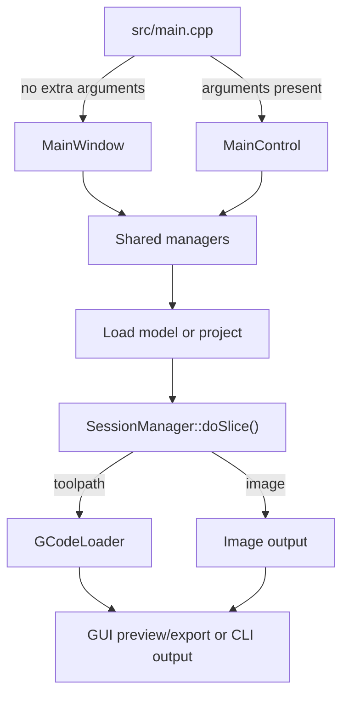

# Application Runtime

This page describes application startup, shared runtime ownership, model and
project loading, and the Qt thread boundaries around those operations. See the
[architecture overview](../../ARCHITECTURE.md) for the higher-level system map.

## Entry Point

[`src/main.cpp`](../../src/main.cpp) registers the Qt metatypes used by queued
signals, then selects the application shell from the argument count.

| Mode | Application | Controller | Behavior |
| --- | --- | --- | --- |
| GUI, no extra arguments | `QApplication` | `MainWindow` | Initializes icons, shaders, styles, and configs from Qt resources, builds the UI, and enters the GUI event loop |
| CLI, one or more arguments | `QCoreApplication` | `MainControl` | Parses arguments into `SettingsBase`, loads input geometry or a project, slices it, parses the result when required, and writes the requested output |

The shells differ, but neither owns a separate slicing implementation. Both use
the same `SessionManager`, `SettingsManager`, and concrete slicers. Toolpath
modes also share the writer and G-code loader; image slicing bypasses them.

### GUI Startup

[`MainWindow::continueStartup()`](../../src/windows/main_window.cpp) performs
the application-level GUI setup:

1. Import user preferences through `PreferencesManager`.
2. Discover installed and user template directories and load their settings.
3. Construct the active global settings from recent selections.
4. Create the windows, views, settings controls, toolbars, dialogs, and signal
   connections owned by the main window.

`MainWindow` is a singleton and a UI composition root, not the owner of session
or setting data. Widgets call or subscribe to the shared managers for model and
configuration state.

### CLI Startup

[`MainControl`](../../src/console/main_control.cpp) receives the converted
command-line `SettingsBase`. It configures console settings, loads models or a
project through `SessionManager`, waits for the expected `partAdded` signals,
and calls `SessionManager::doSlice()`.

After slicing, non-image workflows pass the generated file through
`GCodeLoader`. That parse is still required in CLI mode because it can apply
minimum-layer-time changes and produces the selected syntax metadata used to
name the final output.

## Shared Ownership

### Session Manager

[`SessionManager`](../../include/managers/session_manager.h), commonly accessed
through `CSM`, is the session coordination hub. It owns or coordinates:

- loaded `Part` objects and their meshes, settings, transforms, and computed
  steps;
- raw input model bytes retained for project archives;
- the last session-file path, which may be an autosave, and recent model,
  project, G-code, and settings locations;
- project load/save operations;
- active slicer selection, cancellation, progress forwarding, and slice
  completion;
- the temporary G-code output location.

Changes that affect model lifetime or the transition from loaded parts to
slicing should begin in
[`session_manager.cpp`](../../src/managers/session_manager.cpp). Project archive
layout and entry serialization primarily live in `SessionLoader`, alongside
the session JSON helpers in `SessionManager`.

### Settings and Preferences

[`SettingsManager`](../../include/managers/settings/settings_manager.h),
accessed through `GSM`, owns settings metadata, active global values, templates,
and settings migration. `PreferencesManager` owns workstation/user choices such
as display units, themes, import behavior, and visualization preferences. These
are separate lifecycles: process settings affect generated toolpaths, while
preferences primarily affect application behavior and presentation.

The settings pipeline is described in [Settings System](settings-system.md).

### Main Window

`MainWindow` owns the Qt widget tree and connects worker results to their GUI
consumers. Important children include `PartWidget`, `GCodeWidget`, `SettingBar`,
`LayerBar`, `GcodeBar`, `LayerTimesWindow`, and `GcodeExport`. Qt parent ownership
handles most widget destruction.

Avoid putting durable model or settings state in a widget when an existing
manager already owns that state. Widgets should present state and send user
intent across the existing manager APIs and signals.

## Model Loading

[`SessionManager::loadModel()`](../../src/managers/session_manager.cpp) supports
two execution paths:

- GUI and other asynchronous callers create a
  [`MeshLoader`](../../include/threading/mesh_loader.h), connect its `newMesh`
  and error signals, and call `start()`.
- Synchronous callers use `MeshLoader::LoadMeshes()` directly. The CLI uses this
  path for explicitly supplied model files so its input count can be tracked
  deterministically.

`MeshLoader` uses Assimp for STL, 3MF, OBJ, AMF, and other supported mesh
formats. STEP/STP input follows a separate OpenCASCADE path, is triangulated,
and is converted into the project's CGAL-backed mesh types. The loader also
returns the raw bytes. `SessionManager` wraps loaded meshes in `Part` objects,
assigns unique names, retains the raw bytes for project persistence, and emits
`partAdded` after the session state is ready.

Keep format-specific mesh construction in `MeshLoader` or the types under
`geometry/mesh/`. Keep session naming, lifetime, and notification in
`SessionManager`.

## Project Persistence

ORNLSlicer project files use the legacy `.s2p` extension and are ZIP archives.
[`SessionLoader`](../../src/threading/session_loader.cpp) saves and restores:

- active model files under the archive's model directory;
- session JSON containing part names, geometry references/types, original
  dimensions, and transforms;
- active global settings;
- per-part settings and layer ranges;
- a human-readable version marker.

`SessionManager` creates the loader and updates recent-project state. It reads
the archive's global settings once before starting the worker so version
migration can be confirmed. The main archive save/load then runs through
`SessionLoader` on its `QThread`.

`SessionLoader` is an important exception to a signal-only worker handoff. Its
save path reads `CSM`, `GSM`, and `Part` state directly, and its load path
mutates those shared objects from the worker thread. `SessionLoader` itself
signals completion and errors, while the manager calls it makes can also emit
normal state notifications such as project-part counts and `partAdded`. Treat
changes here as thread-sensitive and do not assume the worker owns an isolated
project-data snapshot.

When changing the project shape, update save and load together. Decide whether
the new data belongs to session JSON, the global settings entry, per-part local
settings, or an embedded model file, and preserve compatibility with older
archives where practical.

## Worker Boundaries

| Worker | Mechanism | Produces |
| --- | --- | --- |
| `MeshLoader` | `QThread` subclass, plus a synchronous static helper | Mesh objects and raw model bytes |
| `SessionLoader` | `QThread` subclass | ZIP archive changes and direct shared session/settings access; completion and errors are signaled |
| `GCodeLoader` | `QThread` subclass | Parsed text, visual segments, statistics, and export metadata |
| `AbstractSlicingThread` | `QObject` moved to an internal `QThread` | Preprocessing, step scheduling, postprocessing, and G-code output |
| `StepThread` | `QObject` with its own internal `QThread` | `Step::compute()` completion |

Qt queued connections are part of the architecture. Custom payload types not
already known to Qt must be registered in `src/main.cpp` before crossing those
connections. Most workers report data and status through signals for GUI-side
consumers. The synchronous
`MeshLoader::LoadMeshes()` CLI path and `SessionLoader`'s direct manager access
are current exceptions, not a general pattern to copy.

Do not update widgets from a loader, slicer, or step worker. Do not add blocking
file or geometry work to a GUI slot when it fits one of the existing worker
paths.

## Common Change Paths

- New mesh input behavior: `MeshLoader`, `geometry/mesh/`, then
  `SessionManager::loadModel()` if session semantics change.
- New project data: `SessionLoader` save/load and the corresponding
  `SessionManager` session JSON helpers in the same change.
- New top-level GUI surface: `MainWindow` for composition, then a focused widget
  or window class for the behavior.
- New CLI behavior: `CommandLineConverter` for option conversion and
  `MainControl` for orchestration; keep slicing logic in the shared pipeline.
- New cross-thread payload: register the metatype in `src/main.cpp`, define a
  clear owner, and connect cleanup with the worker lifecycle.
