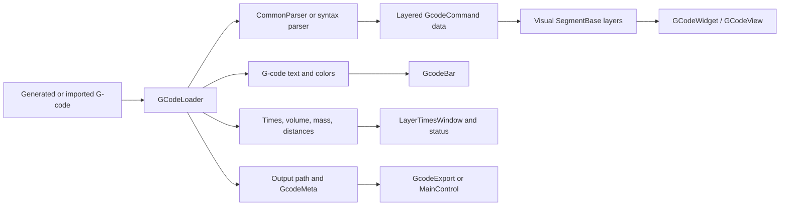

# G-Code and Visualization

This page describes machine-specific G-code generation, parser selection,
`GCodeLoader`, preview data, and the OpenGL view boundary. See the
[architecture overview](../../ARCHITECTURE.md) for the surrounding system and
[Slicing Pipeline](slicing-pipeline.md) for the upstream path model.

## Generation Boundary

Toolpath geometry is machine-neutral until it reaches a writer. A `Path`
contains `SegmentBase` objects, and generated segment types normally delegate
their text output to a
[`WriterBase`](../../include/gcode/writers/writer_base.h) implementation. The
current `BezierSegment` is a parser/preview representation whose `writeGCode()`
returns no text. G5/Bezier motion is therefore import-and-preview-only in this
path, and not every parsed segment can be round-tripped through generation.

[`AbstractSlicingThread::setGcodeOutput()`](../../src/threading/abs_slicing_thread.cpp)
reads the active `GcodeSyntax` and constructs the corresponding writer and
`GcodeMeta`. The common output lifecycle is:

1. `writeGCodeSetup()` writes the slicer/syntax identifier, embedded settings,
   and initial machine setup.
2. The concrete slicer walks its ordered steps or layers. Layer, island,
   region, path, and segment types call the selected writer for syntax-specific
   text.
3. `writeGCodeShutdown()` writes machine shutdown and the settings footer where
   the syntax supports it.

[`GcodeMeta`](../../include/gcode/gcode_meta.h) carries syntax-level facts used
by both generation and parsing, including comment delimiters, units, file
suffix, and travel representation. Keep these facts out of geometry code.

Concrete writer classes live under
[`include/gcode/writers/`](../../include/gcode/writers/) and
[`src/gcode/writers/`](../../src/gcode/writers/). `WriterBase` supplies shared
formatting and lifecycle hooks; subclasses override only the behavior that
differs for a controller or machine family.

`ArcSpecialtiesWriter` supports both the normal planar segment stream and the
direct radial/helical cylindrical streams. Planar output keeps the active planar
regions and uses `Axis C` as a fixed `CP` positioner value; cylindrical output
keeps its cylinder-axis `CP` calculations and radial travel-lift behavior.

## Parse and Fan-Out Flow

Generated files and imported G-code converge at
[`GCodeLoader`](../../src/threading/gcode_loader.cpp).

`GCodeLoader` is a `QThread` subclass. Its `run()` method:

1. reads the file and searches the header for the syntax identifier;
2. selects `CommonParser` or a specialized parser;
3. parses settings/header/footer data and layered `GcodeCommand` motion data;
4. applies minimum-layer-time modification when enabled;
5. computes time, volume, mass, and distance statistics;
6. converts motion commands into display-space line, arc, travel, and other
   visual segments with line/layer metadata;
7. emits independent payloads for visualization, text, statistics, status, and
   export.

If no syntax identifier is found, the loader falls back to `CommonParser`
configured with Marlin rules. The current no-header branch does not also assign
the loader's selected export metadata, so imported files without a recognized
header should not be assumed to have deterministic export units or naming.
Generated writers should always emit the standard syntax header.

## Parser Layers

[`ParserBase`](../../include/gcode/parsers/parser_base.h) provides shared parser
state and the abstract contract. [`CommonParser`](../../include/gcode/parsers/common_parser.h)
implements the common header/footer, motion, timing, and file-adjustment path.
Syntax-specific parsers under `gcode/parsers/` extend or specialize that
behavior for controller dialects that cannot use the common rules.

Parser output is not the OpenGL object itself. It is layered `GcodeCommand`
data, which `GCodeLoader` interprets into the same `SegmentBase` family used by
the rest of the application. During that conversion, the loader attaches:

- display type and color derived from region/modifier comments;
- bead width, height, and display length from effective settings;
- source line and layer numbers for selection and text synchronization;
- user-facing segment information such as position, speed, extrusion state,
  and length.

That separation keeps dialect parsing independent from OpenGL buffer
construction.

## Loader Consumers

In GUI mode, `MainWindow::importGCodeHelper()` connects loader signals to the
following consumers:

| Signal Payload | Consumer | Responsibility |
| --- | --- | --- |
| Layered visual segments | `GCodeWidget::addGCode()` / `MainWindow` | Hand data to `GCodeView`; a separate `MainWindow` connection initializes `GcodeBar` layer/segment ranges |
| Full text, formats, and layer-start lines | `GcodeBar` | Display and navigate source text |
| Layer timing and feed-rate modifiers | `LayerTimesWindow` | Show original/adjusted layer timing |
| File path and `GcodeMeta` | `GcodeExport` | Name and export the final controller file |
| Summary/status text | `MainWindow` | Display time, mass, distance, and errors |

CLI mode connects only the outputs needed to write the final file and report
progress; it does not construct an OpenGL view.

## Graphics Architecture

[`BaseView`](../../include/graphics/base_view.h) is the shared `QOpenGLWidget`
base. It owns camera controls, shaders, render roots, common input handling, and
picking support. Domain-specific views decide which graphics object tree to
attach.

### Part View

[`PartView`](../../include/graphics/view/part_view.h) renders the loaded model
state represented by `PartMetaModel`. `PartObject` owns the drawable part mesh,
feature edges, overhang appearance, transforms, and the current planar or
cylindrical slicing-geometry preview. Printer, grid, axis, label, and settings
range objects provide the surrounding editing context.

Part visualization is driven by session/model state. It does not render parsed
G-code.

### G-Code View

[`GCodeView`](../../include/graphics/view/gcode_view.h) owns the parsed preview
state: visible layer/segment ranges, hidden display types, selection/highlight,
printer context, optional ghosted parts, and true-width preference.

[`GCodeObject`](../../include/graphics/objects/gcode_object.h) batches all
preview segments into shared OpenGL buffers instead of creating one graphics
object per move. It preserves per-segment metadata for visibility, color,
selection, picking, and source-line correlation.

Preview rendering has two main representations:

- true-width printable moves expand segments into bead meshes;
- lightweight preview draws batched line geometry, including tessellated arcs.

The toolbar's true-width toggle requests bead geometry. The user's
`GCodePreviewMode` and vertex threshold then decide whether a full true-width
object is built. `GCodeView` can add a true-width overlay for a small visible
subset while retaining a lightweight base object for a large file. Travel
moves use a separate line buffer only in the mixed true-width representation;
the lightweight representation keeps all moves in the primary shared line
buffer.

Keep parsed geometry and line/layer metadata stable across both rendering
representations so filtering, picking, and text synchronization behave the same
regardless of preview quality.

## Adding a G-Code Syntax

A complete syntax integration normally touches all of these seams:

1. Add the `GcodeSyntax` value and stable string mapping in
   `include/utilities/enums.h` (plus JSON conversion where required).
2. Add a `GcodeMeta` entry with correct units, delimiters, suffix, and travel
   semantics.
3. Register that metadata in `GcodeMetaList::SyntaxToMetaHash`; temporary output
   suffix selection indexes this mapping in `SessionManager::doSlice()`.
4. Add a `WriterBase` subclass or deliberately reuse an existing writer.
5. Route writer selection in `AbstractSlicingThread::setGcodeOutput()`.
6. Make the emitted syntax header identify the new syntax.
7. Add a parser subclass when `CommonParser` cannot represent the dialect.
8. Route header detection and parser/meta selection in `GCodeLoader::setParser()`.
9. Add settings metadata and migrations for any serialized enum-position
   change.
10. Exercise generation, parser reload, visual segments, statistics, and export
   naming together.

Some syntaxes are import-only, share writers/parsers, or require specialized
saver threads. Document such exceptions beside their selection switch instead
of relying on enum naming alone.

## Adding Preview Behavior

- A new semantic region/modifier display type needs a stable comment emitted by
  writers, detection and color assignment in `GCodeLoader`, enum/filter support,
  and matching UI controls.
- A new motion command needs parser output plus `generateVisualSegment()`
  geometry, metadata, and both lightweight/true-width rendering support where
  applicable.
- A new part-editing overlay belongs in `PartView`/`PartObject`; a parsed
  toolpath overlay belongs in `GCodeView`/`GCodeObject`.
- Performance changes should preserve source line numbers and segment ordering;
  those are the bridge between the text editor, picking, and metadata display.

## Guardrails

- Do not put controller formatting in `SegmentBase` subclasses when the writer
  can own it.
- Keep syntax units and file properties in `GcodeMeta`, shared by writer and
  parser paths.
- Treat writer generation and parser reload as one compatibility contract.
- Keep `GCodeLoader` off the GUI thread and return UI-ready payloads through
  signals.
- Batch G-code rendering. Per-move `GraphicsObject` allocation does not scale to
  production files.
- Preserve a lightweight fallback for previews whose true-width vertex estimate
  exceeds the configured threshold.
