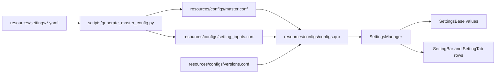

# Settings System

This page describes the settings source files, generated artifacts, runtime
containers, override scopes, UI construction, templates, and migrations. See
the [architecture overview](../../ARCHITECTURE.md) for the surrounding system.
For a task-oriented walkthrough, see
[Adding a New User Setting](../wiki/Adding-a-New-User-Setting.md).

## Source and Generation Pipeline

Canonical setting metadata lives in
[`resources/settings/*.yaml`](../../resources/settings/). The files are read in
sorted path order, and entries remain in file order so the source layout also
controls generated/UI ordering.



[`scripts/generate_master_config.py`](../../scripts/generate_master_config.py)
validates the project's supported YAML subset and writes two JSON artifacts:

- `master.conf` contains each scalar setting's key, display metadata, type,
  dependency expression, options, default, categories, constant metadata, and
  local-setting flag.
- `setting_inputs.conf` describes composite input rows, currently vector-style
  widgets whose components remain independently stored scalar settings.

[`resources/configs/configs.qrc`](../../resources/configs/configs.qrc) embeds
both generated files and `versions.conf`. The GUI entry path initializes this
resource bundle before any settings singleton is constructed.

The CMake `generate_master_config` target runs the generator automatically when
`ORNLSLICER_AUTO_GENERATE_MASTER_CONFIG` is enabled. The direct command is:

```bash
python3 scripts/generate_master_config.py \
  resources/settings \
  resources/configs/master.conf \
  resources/configs/setting_inputs.conf
```

Read [`resources/settings/README.md`](../../resources/settings/README.md) and
[Generating the Master Settings File](../wiki/Generating-the-Master-Settings-File.md)
before changing the schema or generator.

## Runtime Ownership

[`SettingsManager`](../../include/managers/settings/settings_manager.h),
accessed through `GSM`, is the settings lifecycle owner. Its constructor loads:

- `:/configs/master.conf` into the master metadata `SettingsBase`;
- `:/configs/setting_inputs.conf` into composite-input metadata;
- every master default into the active global `SettingsBase`;
- `:/configs/versions.conf` as the current template/settings version.

The manager also owns discovered global templates, layer-bar templates, console
settings, the active layer-bar template name, and the signals used to refresh
settings controls. GUI global-template selections are tracked by `SettingBar`
and `SessionManager`'s recent-setting history rather than that layer-bar name.

[`SettingsBase`](../../include/configs/settings_base.h) is the common value
container. It stores JSON-backed key/value data and provides typed `setting<T>`
and `setSetting<T>` access, overlay through `populate`, removal through
`splice`, and global/local adjustment passes.

Use the narrowest settings object available to a calculation. Code that is
computing one layer or region should normally consume the settings snapshot
passed into that object, not reach back to `GSM->getGlobal()` and bypass local
overrides.

## Effective Settings Scopes

Settings are layered before path computation. For the planar pipeline, the
effective order is:

1. Master defaults initialize the active global settings.
2. Selected printer, material, profile, and experimental templates overlay the
   active global values.
3. `SettingsBase::makeGlobalAdjustments()` resolves programmatic constraints on
   the copied global snapshot.
4. A `Part` settings base overlays the adjusted global values for that part.
5. Matching [`SettingsRange`](../../include/configs/settings_range.h) values
   overlay the copied part settings for a layer index.
6. `SettingsBase::makeLocalAdjustments()` resolves programmatic local
   constraints for that layer.
7. Settings parts are cross-sectioned into `SettingsPolygon` objects and passed
   to islands/regions for spatially bounded overrides.

```text
master defaults
  -> selected global templates
    -> global adjustments
      -> part overrides
        -> layer-range overrides
          -> local adjustments
            -> spatial settings polygons inside affected regions
```

[`Preprocessor`](../../src/slicing/preprocessor.cpp) constructs the adjusted
global plus part snapshot. [`BufferedSlicer`](../../src/slicing/buffered_slicer.cpp)
applies matching ranges, local adjustments, and settings-part geometry for each
planar slice.

| Mode | Effective Settings Scope |
| --- | --- |
| Planar | Adjusted global copy, part overrides, matching layer ranges, local adjustments, and settings-part polygons |
| Radial/helical | Adjusted global copy, part overrides, and per-layer local adjustments; no layer ranges or settings-part polygons currently |
| Image | Active global settings read directly during image generation |

Inspect the concrete slicer when adding a new override mechanism; the planar
scope is not automatically available to other modes.

The settings scopes have distinct persistence:

- `.s2c` templates serialize template values, and a project's global entry
  serializes the active global values;
- recently selected global template names are workstation history, not part of
  the project archive;
- a `Part` owns its local `SettingsBase`;
- a `Part` also owns its layer `SettingsRange` map;
- a settings-type `Part` carries values whose geometry becomes spatial
  settings polygons during planar preprocessing.

## Settings UI

[`SettingBar::setupGlobalSettings()`](../../src/widgets/settings/setting_bar.cpp)
walks the master metadata. It creates/fetches the `SettingPane` and `SettingTab`
for each major/minor category, finds any composite input metadata through
`SettingsManager::getSettingInput()`, and asks `SettingTab` to create the row.

[`SettingTab`](../../src/widgets/settings/setting_tab.cpp) maps scalar metadata
types to concrete `SettingRowBase` subclasses. Composite input metadata selects
the corresponding grouped widget while retaining the scalar component keys.
`SettingBar` separately builds dependency trees from the `depends` metadata and
connects parent rows to rows that must be re-evaluated.

Tooltip text is passed through the generated metadata and wrapped as Qt rich
text by `SettingRowBase`, so small bundled images can be embedded in the
existing `tooltip` field for `Printer`, `Material`, `Profile`, and
`Experimental` settings. Use the
[settings tooltip image procedure](../wiki/Adding-Images-to-Settings-Tooltips.md)
when adding those assets.

This separation matters when extending the UI:

- A new setting using an existing scalar type usually requires YAML and a C++
  constant, not a new widget.
- A new scalar input type requires generator validation, a row class, and the
  `SettingTab` creation mapping.
- A new grouped input requires generator metadata/validation and grouped-widget
  handling while preserving stable scalar storage keys.
- A dependency feature belongs in the metadata parser and `SettingBar`
  dependency tree, not in one arbitrary row subclass.

## Templates and Versions

Global setting templates use the legacy `.s2c` extension. Layer-setting
templates use `.s2l`. `SettingsManager` discovers templates in installed and
user-selected directories, groups global values by major category, and overlays
the chosen template from each category into the active global settings.

[`resources/configs/versions.conf`](../../resources/configs/versions.conf)
contains the current `master_version`. When a template or project global entry
has an older version, `SettingsManager::checkVersion()` delegates to
[`SettingsVersionControl`](../../src/managers/settings/settings_version_control.cpp)
to roll it forward.

Add a migration when a saved value's meaning changes, including:

- renaming or removing a setting key;
- changing the positional value of a serialized enum;
- splitting or combining behavior represented in old templates;
- changing a default when existing files must preserve their former behavior.

Update the version only with a complete roll-forward path. Loading an older
project may rewrite its global settings entry after migration, so migration
code must be safe for both standalone templates and project archives.

## Adding or Changing a Setting

1. Edit the appropriate YAML file under `resources/settings/`; keep the key
   stable and place it in the intended UI order.
2. Add or update its constant in `include/utilities/constants.h` and
   `src/utilities/constants.cpp` when C++ reads it.
3. Regenerate both `master.conf` and `setting_inputs.conf`.
4. Wire the setting into the narrowest owning subsystem and read it from the
   effective settings snapshot at that scope.
5. Add a version migration when existing saved numeric values or keys would be
   reinterpreted.
6. Validate generator output and at least one runtime path that exercises the
   intended global/local scope.

## Guardrails

- Never hand-edit `master.conf` or `setting_inputs.conf`; both are generated and
  should change only as a consequence of YAML/generator changes.
- Do not add a YAML key without keeping the matching C++ constant string exact
  where code consumes it.
- Do not reorder serialized enum values without a settings migration.
- Do not mark a setting `local` unless the consuming path reads effective local
  settings.
- Keep composite UI controls backed by stable scalar keys so project and
  template formats remain flat and compatible.
- Preserve backward-compatible defaults unless a behavior change is explicitly
  intended and migrated.
